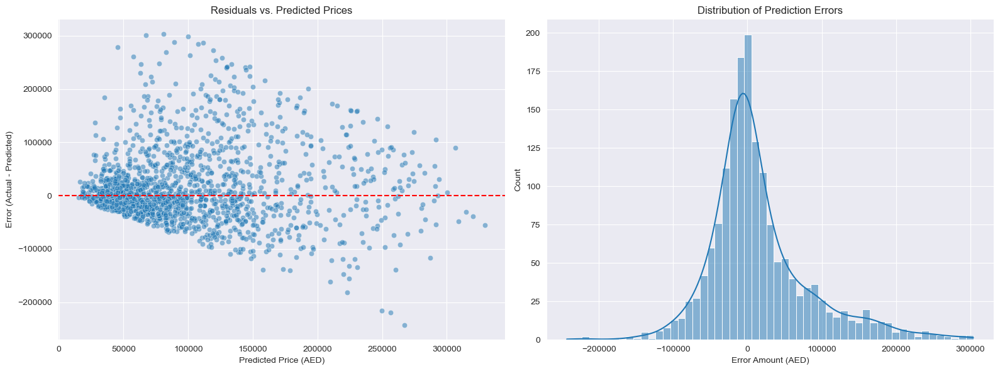

# Gulf Auto Price Intelligence 🚗💨

A Machine Learning project designed to predict used car prices in the UAE market. This repository demonstrates a complete data science workflow: from exploratory data analysis and logarithmic feature engineering to the deployment of a standalone inference engine.

## 📌 Project Context

The UAE car market presents a unique challenge for predictive modeling. Factors such as high luxury car volume, extreme weather conditions affecting vehicle longevity, and the significant price gap between **GCC Specs** and **International Imports** create a complex pricing environment.

This project focuses on the "Predictable Market" segment (cars priced ≤ 400,000 AED) to build a robust estimation tool for micro-creators and educators in the automotive space.

---

## 🏗️ Repository Structure

- `research.ipynb`: The "Lab." Contains data cleaning, visualization, residual analysis, and model training.
- `engine.py`: The "Product." A standalone script that loads the trained model to predict prices for new inputs.
- `uae_used_cars_10k.csv`: The raw dataset of 10,000 vehicle listings.
- `mappings.pkl` & `car_model.pkl`: Serialized "knowledge" and model weights used by the engine.
- `requirements.txt`: List of necessary Python libraries.

---

## 🛠️ Data Science Workflow

### 1. Feature Engineering: The "Log-Log" Approach

Standard linear models struggle with car data because depreciation is exponential, not linear.

- **Target Transformation:** We modeled the `Log_Price` to stabilize variance.
- **Mileage Linearization:** Applied `np.log1p(Mileage)` to treat the first 10,000km of wear as more significant than the difference between 190,000km and 200,000km.

### 2. High-Cardinality Encoding

With hundreds of unique Makes and Models, standard "One-Hot Encoding" would create too many columns. Instead, we used **Target Encoding** (mapping each brand to its average log-price) to keep the model lightweight and fast.

### 3. Model Architecture

We utilized a **Random Forest Regressor** with 300 estimators. This ensemble method was chosen for its ability to capture non-linear interactions between `Age`, `Mileage`, and `Brand Value` without overfitting.

---

## 📉 Key Discovery: The "Spec" Ceiling

During our **Residual Analysis**, we identified a distinct "Funnel" shape (Heteroscedasticity) in the errors.

**Diagnostic:** The model currently has a MAPE (Mean Absolute Percentage Error) of ~52%. Our analysis confirms that this error is primarily driven by **Latent Variables**—specifically the lack of a "Spec" (GCC vs. Import) column in the dataset. This insight provides a clear roadmap for Version 2.0.



---

## 🚀 Usage

### Installation

```bash
pip install -r requirements.txt
```

## 🗺️ Future Roadmap

This project is the foundation for a suite of automotive intelligence tools. The following milestones are planned to increase model accuracy and commercial utility:

### Phase 1: Data Enrichment (Breaking the Accuracy Ceiling)

- **Spec Identification:** Integrate a "Regional Spec" classifier (GCC vs. North American vs. Japanese) to resolve the primary source of price variance.
- **Condition Analysis:** Utilize Natural Language Processing (NLP) on the `Description` column to extract key value-drivers like "Full Agency Contract," "First Owner," or "Major Accident History."
- **Market Sentiment:** Scrape daily listing volume to include a "Market Demand" index for specific models.

### Phase 2: Advanced Engineering

- **Hyperparameter Optimization:** Implement `Optuna` or `GridSearchCV` to fine-tune the Random Forest depth and leaf nodes.
- **XGBoost Implementation:** Benchmark the current model against Gradient Boosting machines to see if they better handle the high-cardinality categorical data.

### Phase 3: Deployment & Productization

- **Real-Time API:** Wrap `engine.py` in a **FastAPI** container to allow external websites to request price audits.
- **Web Dashboard:** Build a Streamlit or React frontend for A&M Operations that visualizes depreciation curves for users.
- **Automated Retraining:** Set up a GitHub Action to retrain the model monthly as new UAE market data becomes available.

## 🛠️ Setup for Contributors

To contribute to this project, please set up your local environment using these steps:

### 1. Clone the Repository

```bash
git clone [https://github.com/Moazzam-Matin/Gulf_Auto_Price_Intelligence.git](https://github.com/Moazzam-Matin/Gulf_Auto_Price_Intelligence.git)
cd Gulf_Auto_Price_Intelligence
```
